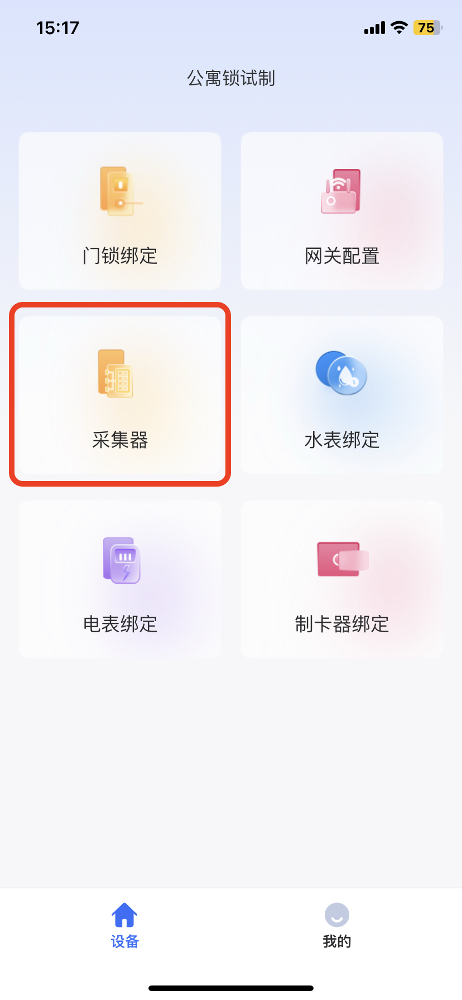
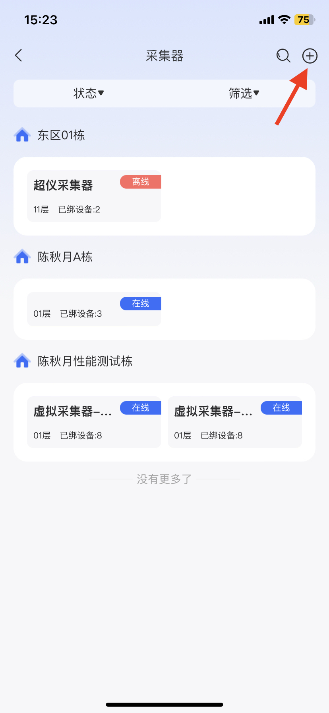
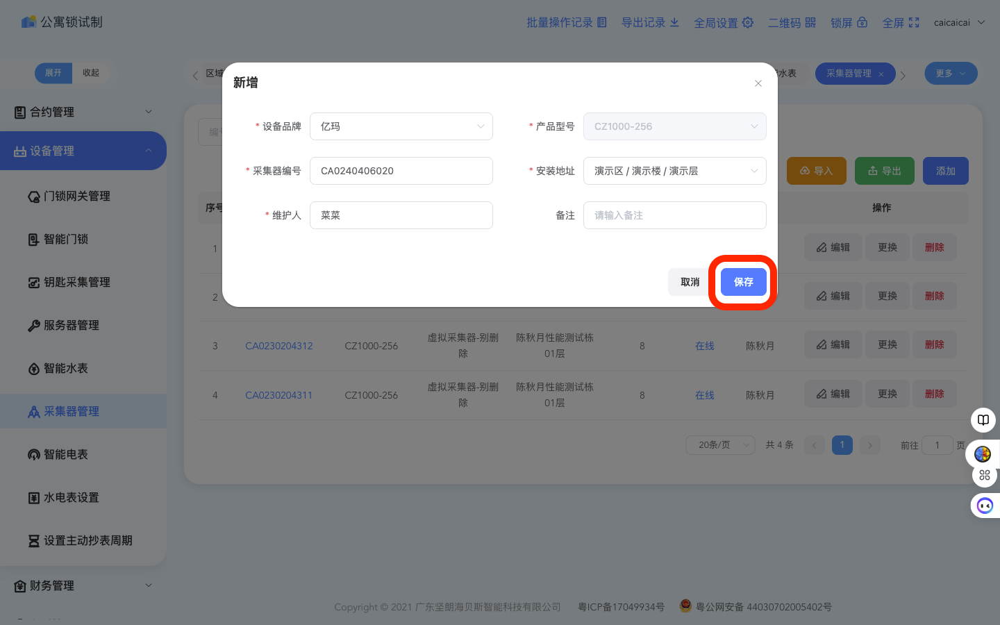
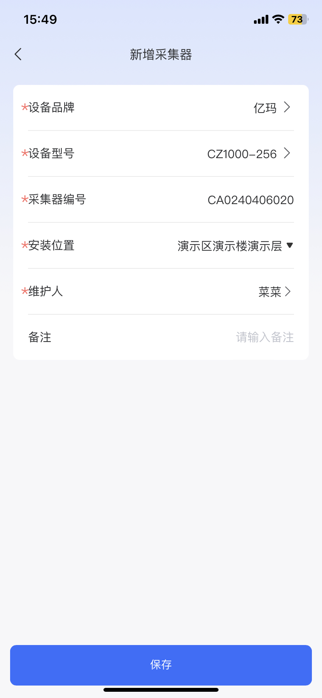
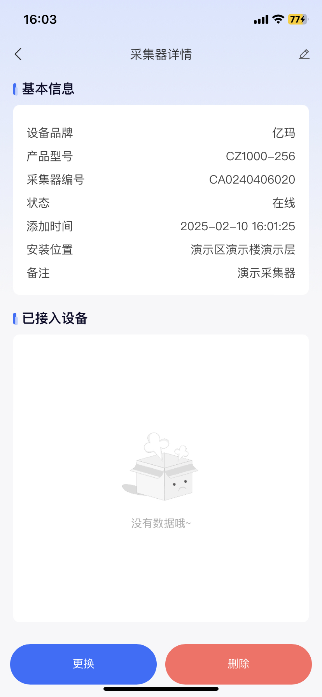

# 绑定水电表采集器

## 1、添加采集器

在管理web端和设备app端都可以添加采集器，只需要输入对应的采集器信息即可，演示如下

<figure><figcaption>
web端：点击添加
</figcaption></figure> <figure><figcaption>
app端：进入采集器
</figcaption></figure> <figure><figcaption>
app端：点击+号添加
</figcaption></figure>

<figure><figcaption>
web端：填写好信息之后点击保存
</figcaption></figure> <figure><figcaption>
app端：点击保存
</figcaption></figure>

网页端与app端都可添加采集器，选一端操作即可

<figure><figcaption>
web端：绑定成功，可查看详情
</figcaption></figure> <figure><figcaption>
app端：查看详情
</figcaption></figure>

