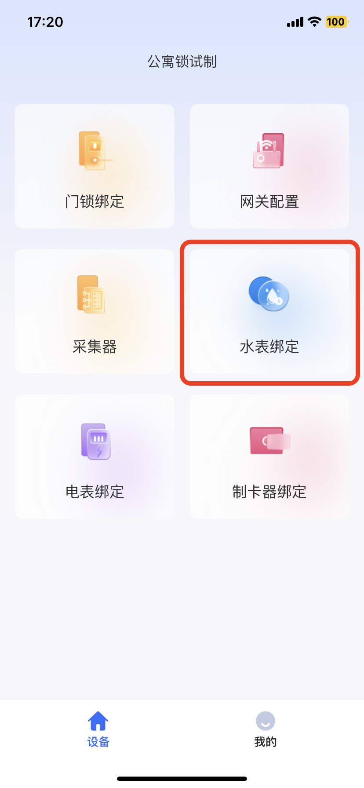
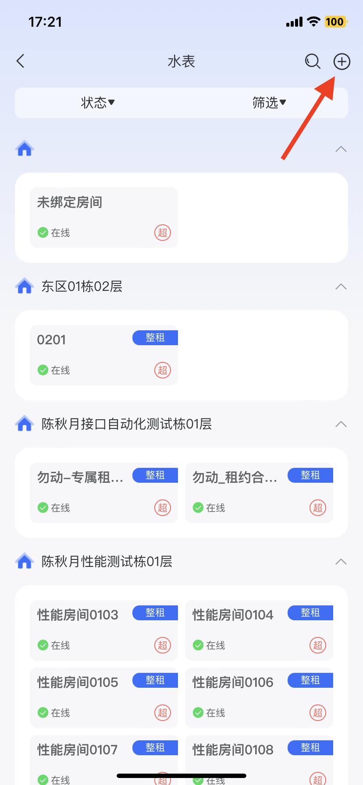

# 绑定智能水表

## 1、添加新水表

管理web端与设备app端都可添加，输入水表信息即可，演示如下

<figure><figcaption>
web端：点击添加
</figcaption></figure> <figure><figcaption>
app端：进入水表绑定
</figcaption></figure> <figure><figcaption>
app端：点击+添加
</figcaption></figure>

<figure><figcaption>
web端添加演示
</figcaption></figure>


点击查看高清视频

