# 门锁绑定

门锁种类参考[设备使用场景介绍](../she-bei-shi-yong-chang-jing-jie-shao.md)

## 1、演示zigbee锁绑定

<figure>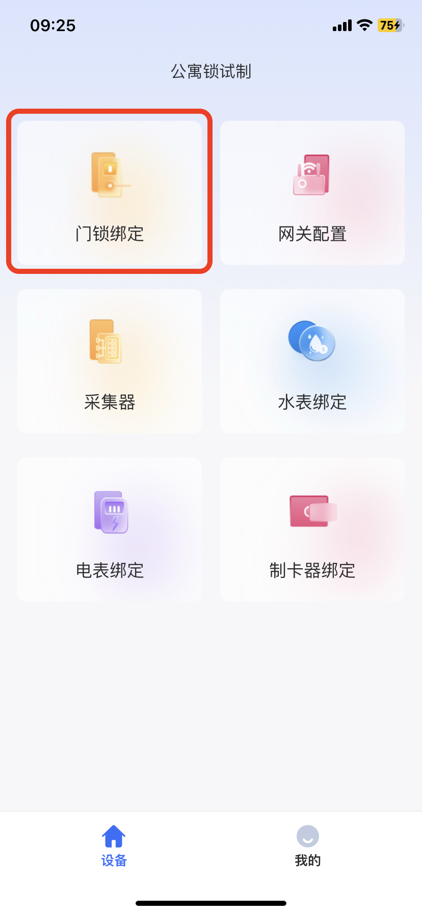<figcaption>
1、进入门锁绑定
</figcaption></figure> <figure>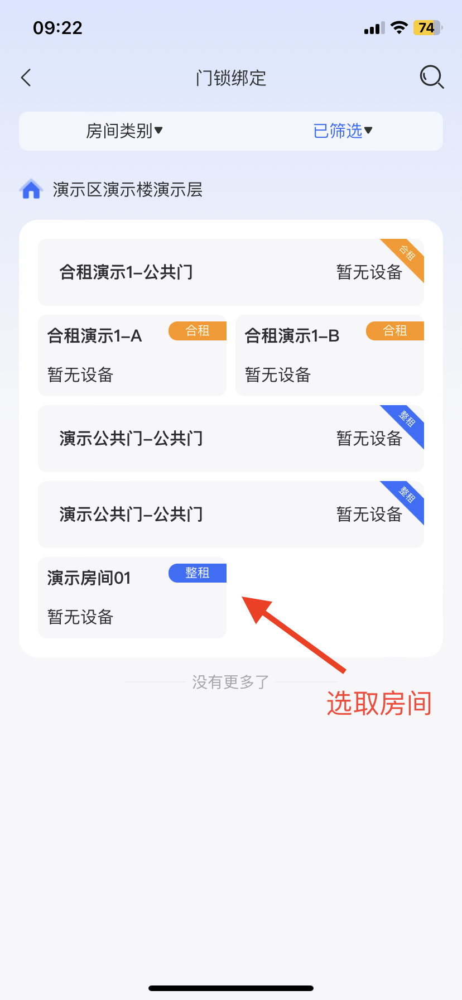<figcaption>
2、选取需要绑定的房间
</figcaption></figure> <figure>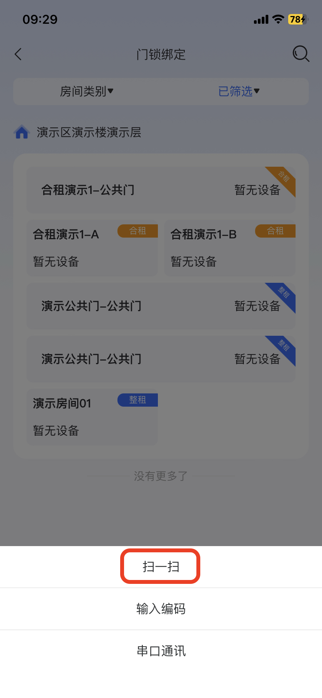<figcaption>
3、使用扫一扫
</figcaption></figure> <figure>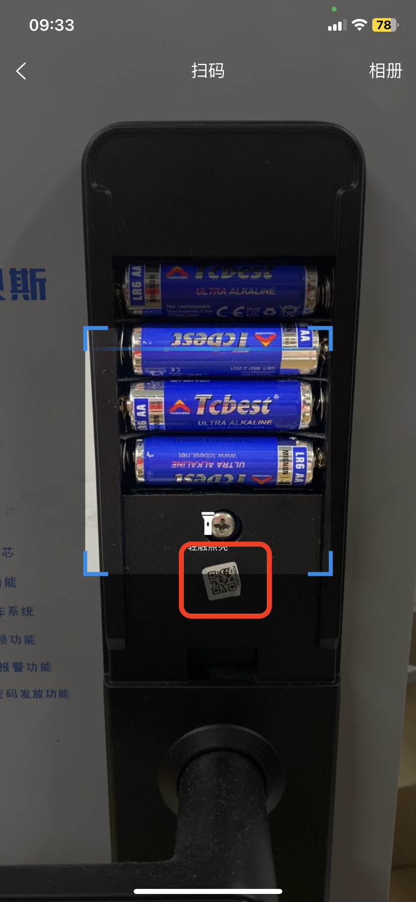<figcaption>
4、扫锁体电池仓盖后的二维码
</figcaption></figure>

<figure>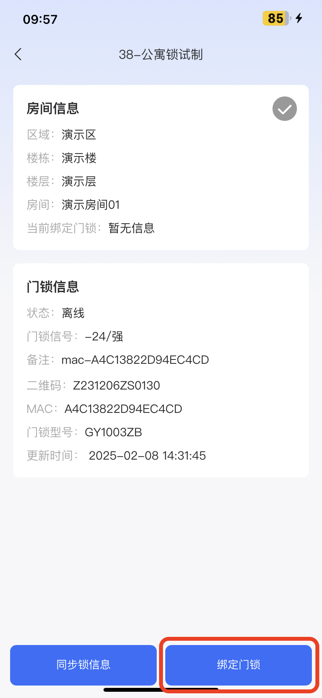<figcaption>
5、扫码后绑定门锁
</figcaption></figure> <figure>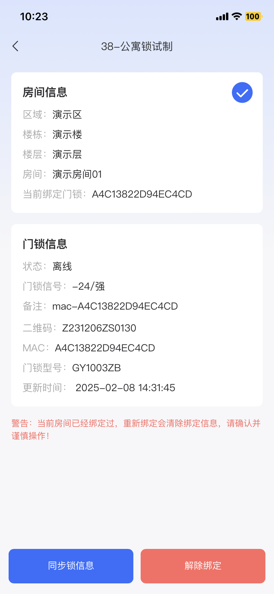<figcaption>
6、绑定成功
</figcaption></figure>

### 绑定网关与门锁

<figure>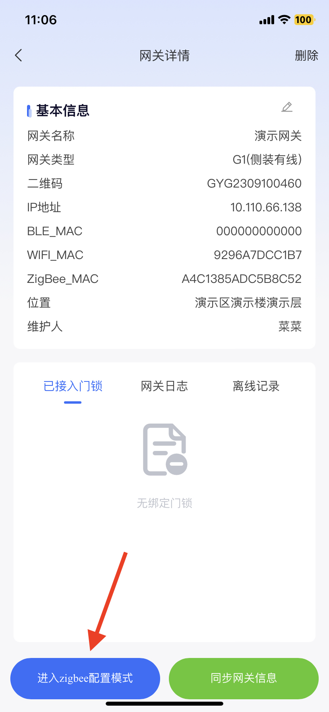<figcaption>
1、进入网关详情
</figcaption></figure> <figure>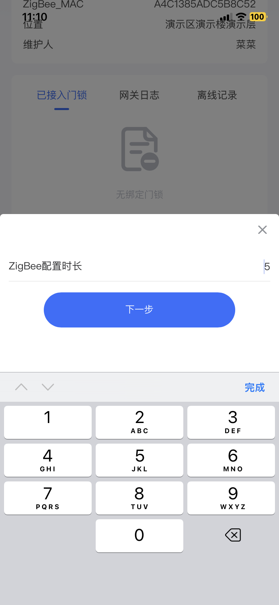<figcaption>
2、填写一个时间，按需填写
</figcaption></figure> <figure>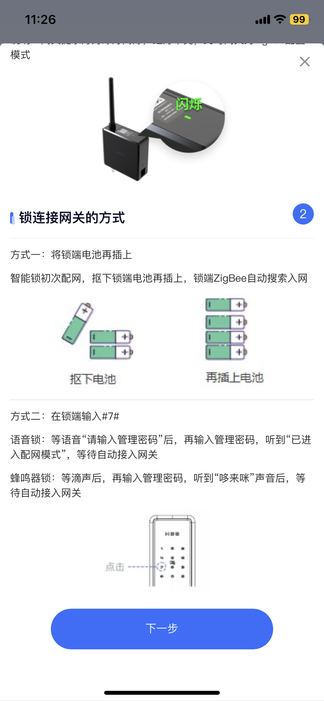<figcaption>
3、点击下一步
</figcaption></figure> <figure>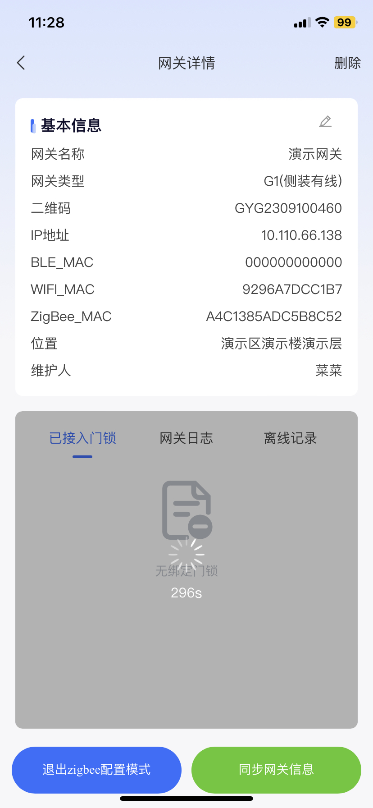<figcaption>
4、网关成功进入配对模式
</figcaption></figure>

### 门锁进入配网模式

<figure><figcaption>
1、输入#7#使门锁进入配网模式
</figcaption></figure> <figure>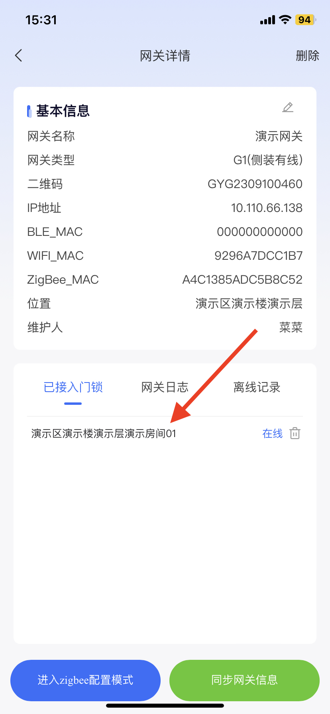<figcaption>
2、绑定成功
</figcaption></figure>

至此zigbee锁即绑定与配网成功，可以正常使用了

## 2、演示NB锁绑定

<figure><figcaption>
1、进入门锁绑定
</figcaption></figure> <figure><figcaption>
2、选取房间
</figcaption></figure> <figure><figcaption>
3、使用扫一扫
</figcaption></figure> <figure><figcaption>
4、扫锁体电池仓盖后的二维码
</figcaption></figure>

<figure>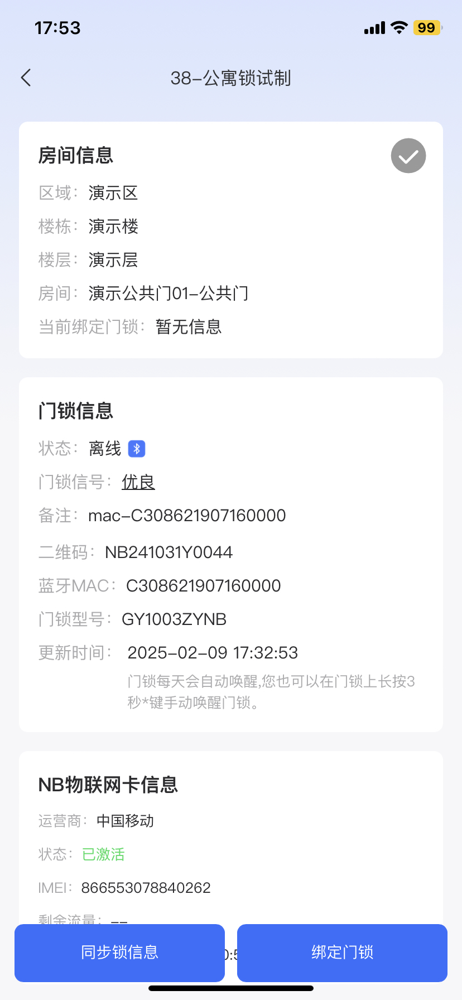<figcaption>
5、点击绑定门锁
</figcaption></figure> <figure>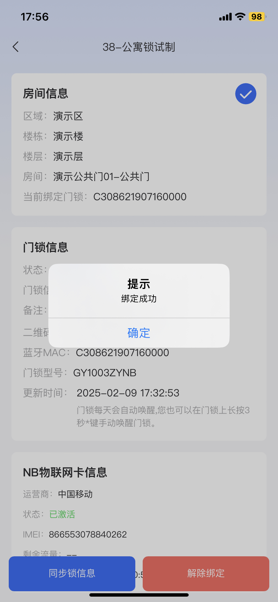<figcaption>
6、绑定成功
</figcaption></figure>

至此NB锁即绑定成功，可以正常使用了

## 3、演示蓝牙锁绑定

<figure><figcaption>
1、进入门锁绑定
</figcaption></figure> <figure><figcaption>
2、选取房间
</figcaption></figure> <figure><figcaption>
3、使用扫一扫
</figcaption></figure> <figure><figcaption>
4、扫锁体电池仓盖后的二维
</figcaption></figure>

<figure>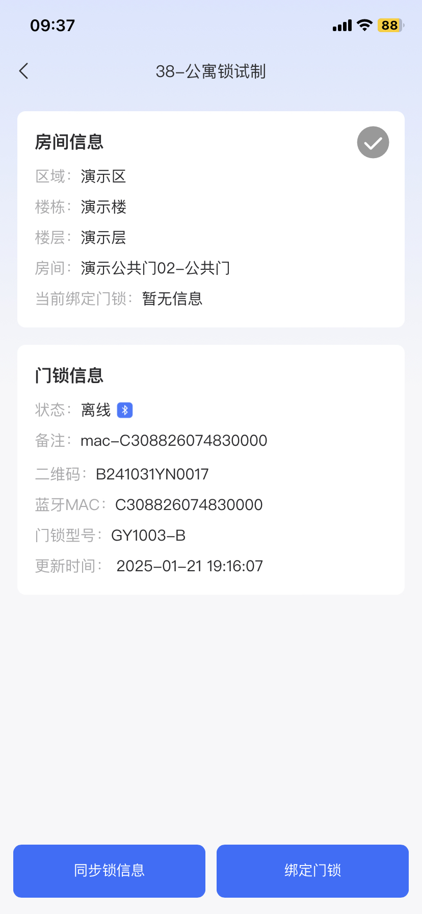<figcaption>
5、点击绑定门锁
</figcaption></figure> <figure>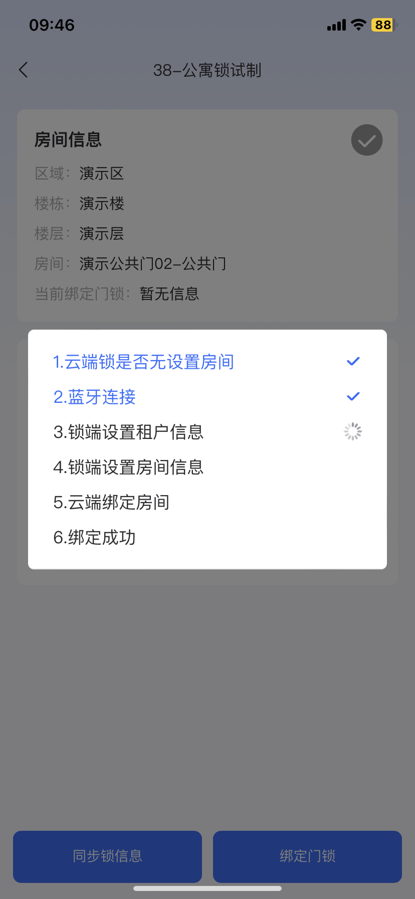<figcaption>
6、等待门锁设置
</figcaption></figure> <figure>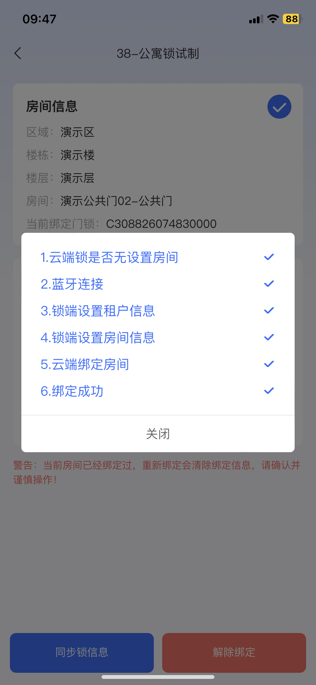<figcaption>
7、绑定成功
</figcaption></figure>

至此蓝牙锁即绑定成功，可以正常使用了
