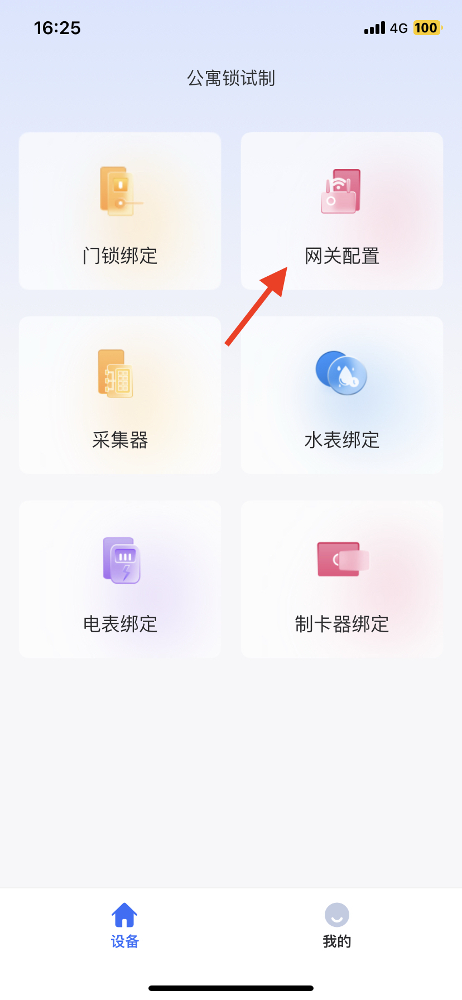
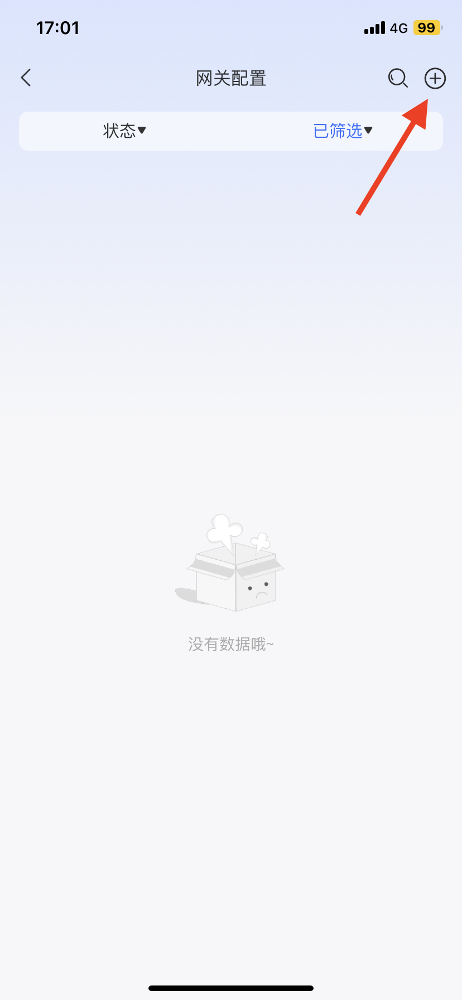
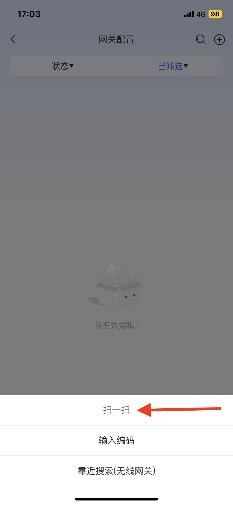
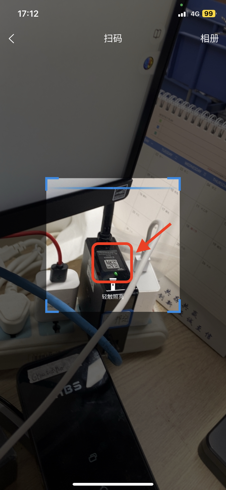
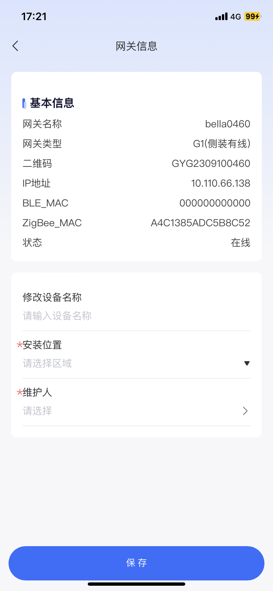
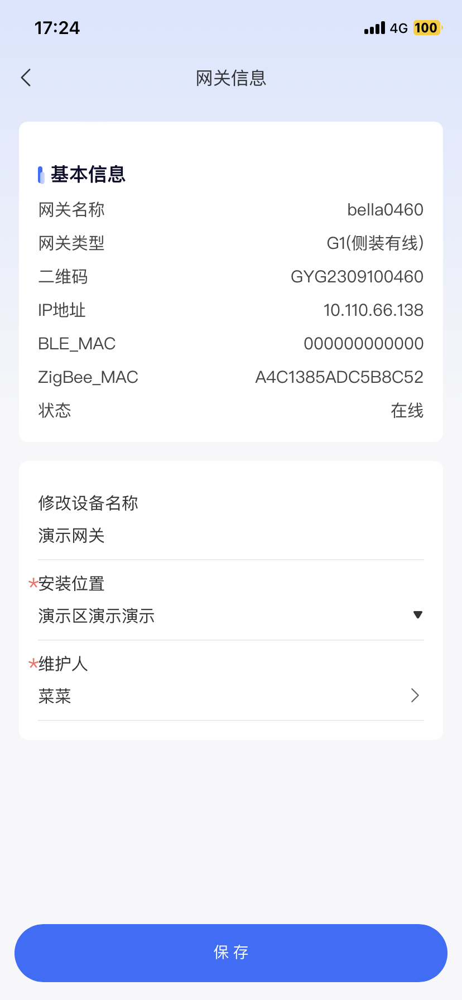
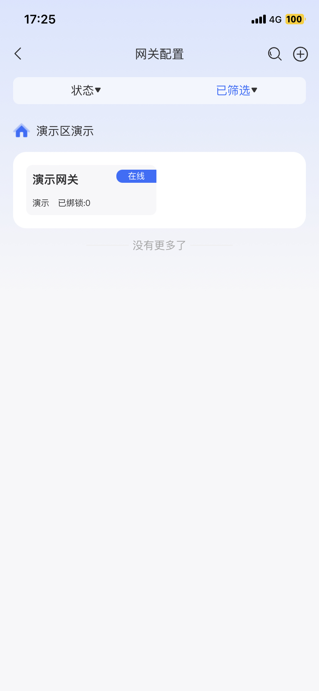
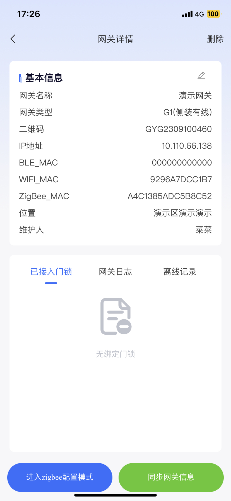

# 门锁网关绑定

使用zigbee锁需绑定网关

## 1、使用寓研家智能设备管理app扫码

<figure><figcaption>
1、点击网关配置
</figcaption></figure> <figure><figcaption>
2、点击+号
</figcaption></figure> <figure><figcaption>
3、使用扫一扫
</figcaption></figure> <figure><figcaption>
4、扫网关上的二维码
</figcaption></figure>

## 2、进行网关信息填写

<figure><figcaption>
1、扫码进入信息页面
</figcaption></figure> <figure><figcaption>
2、填写网关信息
</figcaption></figure> <figure><figcaption>
3、绑定成功
</figcaption></figure> <figure><figcaption>
4、查看详情
</figcaption></figure>

<figure><figcaption>
网页版同步数据展示
</figcaption></figure>

网关绑定成功后，可以进行zigbee锁的绑定
